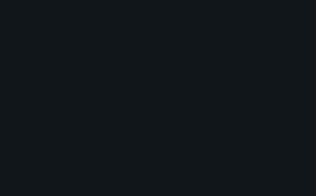

# wallpaper-switcher

> Browse and set your desktop wallpaper from ~/Pictures/Wallpapers.

A self-contained widget for [Übersicht](http://tracesof.net/uebersicht/). The
entire widget lives in `index.jsx` (the shared design system is inlined), so it
runs on any Mac with no extra files beyond the bundled assets.

## Install

1. Install and run [Übersicht](http://tracesof.net/uebersicht/).
2. Unzip `wallpaper-switcher.widget.zip`, or copy the `wallpaper-switcher.widget` folder into your
   Übersicht widgets directory:
   `~/Library/Application Support/Übersicht/widgets/`
3. Refresh Übersicht (menu bar icon -> Refresh All).

## Notes

- Reads images from ~/Pictures/Wallpapers; sets the picture on every display.
- Optional: install the Instrument Serif and Geist font families for the intended typography; system fonts are used as a fallback.

## How to edit

Change the DIR path in the command string in index.jsx to use a different folder.

All visual styling (colors, fonts, the card shell, drag/resize handles) is in
the inlined design-system block at the top of `index.jsx`.

## Bundled files

- `index.jsx`

## Submitting to the Übersicht gallery

Create a public GitHub repo with `widget.json`, `wallpaper-switcher.widget.zip`, and a
258x160 (or 516x320 hi-res) `screenshot.png`, then
[open an issue](https://github.com/felixhageloh/uebersicht-widgets/issues) with the URL.

## Author

Jalen Edusei <jalen.edusei@gmail.com>
